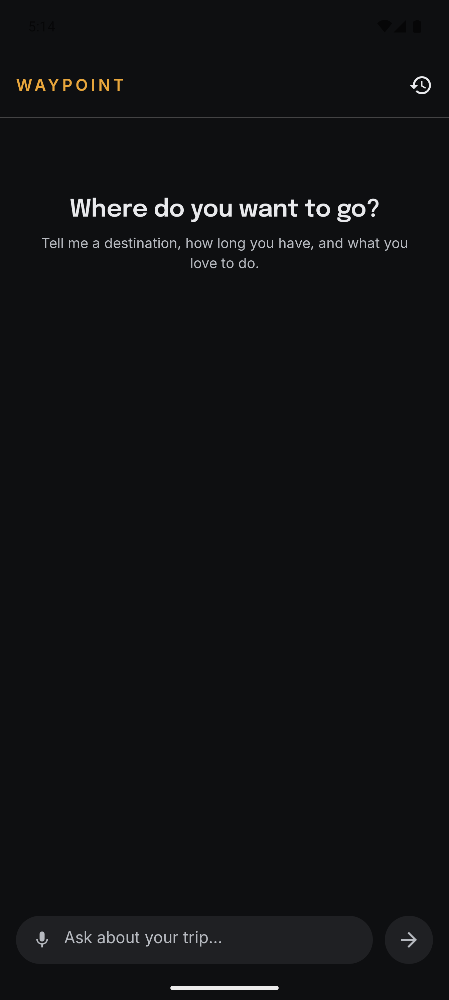
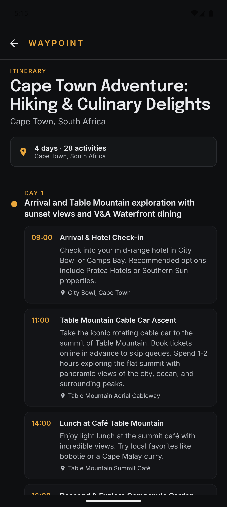
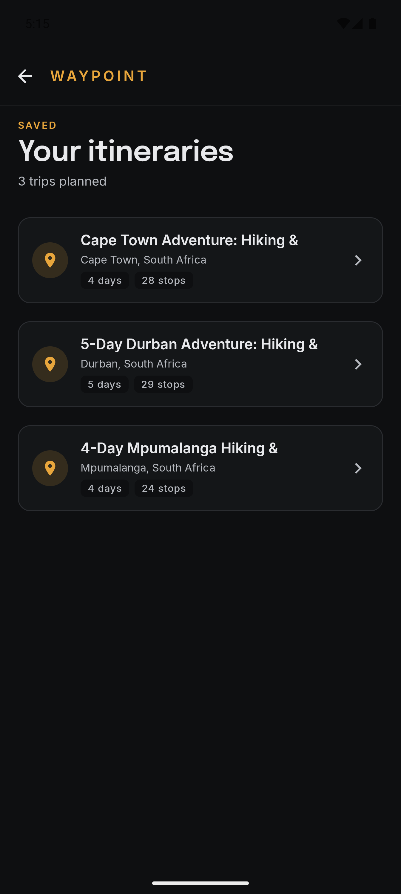
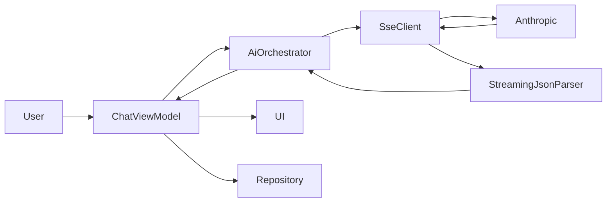

# WayPoint

[](https://github.com/tungamiraimujuru/Waypoint/actions/workflows/ci.yml)
[](https://kotlinlang.org)
[](https://developer.android.com/jetpack/compose)

> **An Android app that streams structured AI into real UI — parsing JSON incrementally so itineraries materialise as the model responds.**  
> Built solo in four days. Architecture and tests reflect early production, not a demo.

<p align="center">
  
</p>

## The pitch

Most AI apps either:

- Block on a spinner, then render everything at once
- Stream tokens into a chat bubble (often raw JSON)

Both treat streaming as a transport detail.

**WayPoint treats streaming as a UX surface.**

The same token stream drives:

- Chat updates (raw tokens)
- Structured UI (parsed events)

The result: users see a real itinerary form in seconds — not a wall of text.

---

## Key idea

Streaming AI is not a networking problem.

It is a **state management problem**.

The challenge is deciding when incomplete data becomes usable UI.

---

## What it looks like

| Streaming chat | Itinerary detail | Saved trips |
|---|---|---|
|  |  |  |

Dark-first by deliberate choice. Travel imagery — food, golden-hour skies, landscapes — reads better against dark surfaces, and committing to one mode lets every state be designed deliberately rather than supporting two compromised variants. The amber + Epilogue + Inter palette signals "editorial travel concierge"; cooler blue/teal would have read as generic booking-app.

---

## How it works



The flow that matters:

1. **Single inbound Flow, two consumers.** Each text delta from Anthropic emits both an `AiStreamEvent.Token` (chat bubble updates) and feeds the incremental parser (which may emit zero or more `Structured(ParseEvent)` events). Same delta, two consumers, one stream — guarantees ordering, simplifies reducer logic.

2. **The parser is a pure state machine.** `WaitingForRoot` → `InsideRoot` → `Complete`. It tracks brace depth string-aware. It handles markdown-fence wrapping. It exposes a buffer-based API where each `feed(delta)` call returns a list of events that became extractable. No I/O, no coroutines, no Android types — testable against a recorded SSE fixture in microseconds.

3. **Cancellation is honoured at every layer.** `CancellationException` is rethrown through the SSE client, the orchestrator, and the ViewModel. Cancelling the chat coroutine cancels the SSE socket. Nothing leaks.

---

## Decisions that mattered, with the trade-offs

Each decision is a fork; here's what I picked and what I gave up.

### Custom incremental parser instead of "wait and parse"

**Picked:** Hand-written state-machine parser that emits domain events as soon as each child object closes.

**Gave up:** The simplicity of `Json.decodeFromString(...)` once at the end of the stream.

**Why:** The "wait" approach is ~30 lines of code; the incremental approach is ~200. But the UX win is structural — the user sees days appear in 1–2 seconds rather than 8–15 seconds of staring at JSON. For an AI-product demo, that's the entire point of the app. The parser also turned out to be the testability anchor: pure state machine, one fixture-based test covers the happy path, character-by-character feeding test covers boundary handling.

**What I, would revisit:** If Anthropic ships a server-side structured output mode (they're moving that way industry-wide), the parser becomes legacy code. I would swap it for the typed-output API and keep the orchestrator interface — at which point the rest of the app doesn't notice.

### No Use Cases between ViewModel and orchestrator

**Picked:** ViewModels depend directly on `AiOrchestrator` and `ItineraryRepository`.

**Gave up:** The canonical Clean Architecture layer that some teams treat as non-negotiable.

**Why:** The `AiOrchestrator` interface is *already* a use-case-shaped boundary — one method, takes a request, returns a domain stream. A `UseCase` wrapper would be a pure pass-through with no behavior added. Use cases earn their keep when orchestration is shared across multiple ViewModels (e.g. a "regenerate itinerary" button on the detail screen invoking the same flow as the chat). v1 doesn't have that; v2 likely will, and that's the natural moment to extract.

**What I, would revisit:** If the team grows past 3 engineers and people start adding business logic into ViewModels, I would extract use cases preemptively as a discipline tool — not because the architecture demands it, but because the team's review bandwidth does.

### Single-table Room schema with JSON blob

**Picked:** One row per itinerary, full domain tree serialised into a `payloadJson` column.

**Gave up:** Idiomatic normalised Room with `@Relation`, foreign keys, the works.

**Why:** WayPoint only needs `getAll()` and `getById()`. Never "find activities by name" or "filter by day count." Normalised storage would mean schema migrations on every domain change. JSON blob trades query power (which I don't need) for migration simplicity (which I always need).

**What I, would revisit:** If a future feature requires cross-itinerary queries — "find all my coffee-shop activities this year" — promote those fields to columns and keep the rest in JSON. Hybrid schema. The migration is a one-time cost.

### Dark-only, no light theme

**Picked:** Single dark theme with amber primary.

**Gave up:** Light/dark switching that 90% of apps support.

**Why:** Supporting both means designing every state twice and shipping two compromised variants. For a four-day timeline focused on streaming UX, that math didn't work. Dark also genuinely fits travel content better — food photography, sunsets, cityscapes have more punch on dark surfaces.

**What I, would revisit:** v2 absolutely. The token system is built for this — the same Amber500/Surface950 tokens map to a different `lightColorScheme()` with no component changes. About a day of work + thorough testing.

### AGP 8.7 instead of AGP 9

**Picked:** Android Gradle Plugin 8.7, Kotlin 2.0.21, Compose BOM 2024.12.

**Gave up:** Bleeding-edge tooling.

**Why:** AGP 9 had recently shipped at the time of writing, and broke Hilt 2.57's `BaseExtension` contract — a forced incompatibility that cost me half a day before I rolled back. Most production Android teams will sit on AGP 8.7 for 6+ months for the same reason. Choosing the version a team would actually use is a more honest signal than choosing the latest.

---

## Risk assessment: what could go wrong with streaming SSE?

This section exists because shipping streaming code without thinking through failure modes is how products embarrass themselves. The risks I planned for, and the mitigations:

| Risk | Mitigation |
|---|---|
| **Network drops mid-stream** | `retryWhen` with bounded attempts (max 2). Only retries on transient errors (`IOException`, 5xx, `RateLimited`). Parse errors don't retry. Exponential backoff would be the v2 upgrade. |
| **Cancellation leaking SSE sockets** | `CancellationException` is rethrown explicitly at every layer (`SseClient`, `RealAiOrchestrator`, ViewModel). Tested manually by force-cancelling mid-stream and verifying no orphan connections in `adb shell netstat`. |
| **Model returns malformed JSON or refuses the schema** | `StreamingJsonParser` swallows individual unparseable events (returns `null` for that delta) rather than failing the whole stream. If `finalize()` can't produce a valid `Itinerary`, `AiError.Parse` surfaces to the UI with a retry option. |
| **Model wraps response in markdown fences despite system-prompt instructions** | Parser's `enterRoot()` strips a leading ```` ```json ```` fence before processing. The first 24 hours of testing showed this happening ~5% of the time despite explicit "do not wrap" instructions in the prompt. Belt-and-braces. |
| **Rate limiting** | `AiError.RateLimited(retryAfter)` is mapped from `429` responses. Retries respect the value if Anthropic returns one. UI surfaces a "slow down" message; doesn't burn credit hammering the API. |
| **API key leakage** | `local.properties` excluded from git, never committed to history (verified). CI uses a stub key that can't talk to Anthropic — we test the build, not the live integration. |
| **Streaming UI updates causing recomposition storms** | LazyColumn uses stable keys (`message.id`); the streaming message and the itinerary preview card are separate items. State changes are batched into the reducer, which produces one new `ChatUiState` per event, not per token. Manually verified with the Compose layout inspector that recomposition is bounded to the streaming message and the preview card. |

The risks I knowingly didn't mitigate, with the reasoning:

- **Cold start performance** — Baseline Profiles would help but matter more for production startup metrics than a demo.
- **Offline mode** — Could cache the most recent itinerary as a fallback. Skipped for time; acceptable degradation is "no network = no new plans."
- **Token streaming backpressure** — Anthropic doesn't send fast enough to overwhelm the parser. If they ever did, `Flow` has buffer operators. Premature mitigation.

---

## Performance — what I measured, what I haven't

**What I measured:**

| Metric | Value |
|---|---|
| Unit test suite (~22 tests) | ~5 seconds |
| `:core:domain` test suite (pure JVM) | ~150ms |
| StreamingJsonParser fixture test (full Cape Town SSE) | ~80ms |
| Chat reducer test suite | ~50ms |
| First commit to green CI | ~5 minutes |

**What I haven't measured but should:**

- **Token-to-UI latency.** Time from a delta arriving over SSE to it appearing in the chat bubble. Compose recomposition is fast, but I haven't profiled the actual delta. The honest answer is "feels instant"; the rigorous answer is "I'll measure with `Trace.beginSection` markers in v1.1."
- **Time-to-first-day.** From send button tap to the first `DayStarted` event rendering. This is the metric that matters for perceived AI speed. Anecdotally ~1.5–2 seconds on broadband; needs measurement under varied network.
- **Recomposition count per second during streaming.** I verified the bounds by hand using the Compose Layout Inspector but didn't capture numbers.

I'm flagging these as "to measure" rather than guessing, because writing claimed metrics I haven't profiled would undermine everything else in this document.

---

## How this scales in a team or production

The architecture WayPoint uses is intentionally one that grows. Here's how each layer extends:

**Adding a new feature module** (e.g. "trip sharing"): a new module under `:feature/`, depends on `:core:ui`, `:core:domain`, `:core:data`. Doesn't touch the AI layer. Doesn't break compilation of the chat module. Build cache benefits: only the new module recompiles.

**Adding a second AI provider** (e.g. Gemini, an on-device LLM, an OpenAI fallback): implement `AiOrchestrator` with the new backend, bind it conditionally in the Hilt module (e.g. via build flavour or runtime selection). The chat ViewModel doesn't change. The reducer doesn't change. Tests don't change.

**Adding voice input**: the chat input bar already has a `Mic` icon as a placeholder. A `SpeechRecognizer`-backed transcription pipeline emits text into the existing draft state. The AI layer below sees no difference — it's just text in.

**Multiple developers**: the multi-module structure means parallel feature work doesn't cause merge conflicts in the chat or AI layers. CI gates every PR. The repository pattern means the data layer can be re-implemented without UI changes.

**Production checklist for v1.1**:
- Crashlytics / Sentry integration in `:app`
- Remote config for prompt versions (already designed for — see `SystemPrompts.ITINERARY_V2`)
- Baseline Profile generation
- Macrobenchmark runs in CI on a milestone release
- Emulator-based instrumented tests (skipped for v1 because of free-tier CI runner flakiness)

---

## What I, would do differently

The decisions I, would reverse with hindsight:

1. **I would build the streaming JSON parser test-first, not implementation-first.** I wrote the parser, then wrote tests against it; the bug-fix cycle (state machine flaw, off-by-one in the test fixture) cost ~45 minutes that disciplined TDD would have caught immediately. The parser is exactly the kind of code where the test is the spec.

2. **I would use Spotless from the start, not as a v2 add-on.** Formatting drifted slightly across modules during the four days. Adding Spotless retrospectively means a "format the whole repo" diff that's hard to review.

3. **I would extract a `StreamItineraryUseCase` after all.** Even though my decision to skip use cases is defensible, the "save itinerary on Done" coordination logic ended up in the ViewModel. It's two lines, but it's logic that should be testable in isolation, not entangled with `viewModelScope`. v1.1 work.

4. **I would record performance traces from day one.** The "to measure" gaps in the table above exist because I didn't set up `androidx.tracing` early. Adding it later means re-recording demos and re-running stream tests under instrumentation.

5. **I would version-control the system prompts as JSON files, not Kotlin constants.** `SystemPrompts.ITINERARY_V2` is a string in source. A versioned JSON file would let me A/B prompt changes via remote config without releasing a new APK. Production-grade prompt management is its own discipline.

---

## How this was actually built

This is the section your reader is most curious about, so I want to be honest about it.

**Built in four days over a long holiday weekend.** No nights. No skipped meals. Maybe 9 hours of focused work per day; standard stuff.

**AI-assisted throughout.** Specifically: I used Claude (the same model WayPoint integrates with) as a paired engineering collaborator. The collaboration shape that worked:

- **I owned the architecture decisions.** Every "should this be a use case", "how should the parser handle markdown fences", "Git Flow or trunk-based" was my call, articulated to Claude as constraints, then implemented.
- **Claude wrote the boilerplate I described.** Compose layouts, Gradle config, Hilt modules, kotlinx-serialization DTOs. Tasks where the *what* is clear and the *how* is mechanical. This is where AI assistance is most leveraged today.
- **I reviewed every diff.** Multiple times Claude suggested patterns I rejected (e.g. wrapping the parser as a `UseCase` for "consistency", or adding a Light theme variant proactively). The rejections matter — they're where my judgment showed up.
- **Bugs were a joint effort.** A 400 from the Anthropic API turned out to be `kotlinx-serialization` dropping default values. The diagnosis and fix came from a back-and-forth: I knew it was a serialization issue from the symptom, Claude proposed `encodeDefaults = true`, I verified it solved it.
- **Design exploration via Stitch.** I generated four UI variants in Stitch, picked the amber + dark + Epilogue combination based on product fit, and ported it manually into a Material 3 token system.

What this *isn't*: "I prompted Claude and it built me an app." That's the pejorative version of AI-assisted development and the result would be unmaintainable.

What it *is*: a working demonstration that an experienced engineer with strong architectural intuition can ship lead-level work in four days when AI is leveraged correctly. The skill is in the directing, the reviewing, and the rejecting — not the typing.

I am flagging this explicitly because how engineers leverage AI in 2026 is itself a skill, and obscuring it would make this document less honest, not more impressive.

A longer write-up of the workflow — including the prompts I used, the patterns that worked, and the patterns that didn't — is the article hooked at the top of this README. If you want the methodology, that's where it'll live.

---

## Stack

| Concern | Choice |
|---|---|
| Language | Kotlin 2.0.21 |
| UI | Jetpack Compose (BOM 2024.12) + Material 3 |
| Async | Coroutines + Flow |
| DI | Hilt 2.53.1 (KSP, not kapt) |
| HTTP | Ktor 3.0.3 with OkHttp engine |
| Serialization | kotlinx-serialization 1.7.3 |
| Local storage | Room 2.6.1 |
| AI | Anthropic Claude Sonnet 4.5 via Messages API + SSE |
| Build | AGP 8.7.3, Gradle 8.10.2, JDK 17 |
| CI | GitHub Actions (build, lint, test, APK on every PR) |

## Module structure

```

Waypoint/
├── app/                    # Application module, navigation, Hilt setup
├── core/
│   ├── ai/                 # Orchestrator, prompts, streaming parser
│   ├── data/               # ItineraryRepository + Room implementation
│   ├── database/           # Room entity, DAO, database
│   ├── domain/             # Pure-Kotlin models — no Android dependency
│   ├── network/            # Ktor HTTP client + content negotiation
│   └── ui/                 # Theme, typography, shared design system
├── feature/
│   └── chat/               # ChatScreen, ChatViewModel, ItineraryDetail, Saved
├── docs/                   # Screenshots, demo GIF
└── .github/workflows/      # CI configuration

## Running locally

```bash
git clone https://github.com/tungamiraimujuru/Waypoint.git
cd Waypoint
echo "ANTHROPIC_API_KEY=sk-ant-your-key-here" >> local.properties
./gradlew check    # run tests + lint
./gradlew :app:installDebug    # install on connected device
```

## Future work

In rough priority order:

1. Voice input via `SpeechRecognizer` (Mic icon already placeholder)
2. Maps integration — render lat/lng as activity markers
3. Itinerary regeneration button (the moment to extract `StreamItineraryUseCase`)
4. Performance traces — token-to-UI latency, time-to-first-day, recomposition count
5. Baseline Profiles + Macrobenchmark for production startup metrics
6. Light theme via existing token system

---
